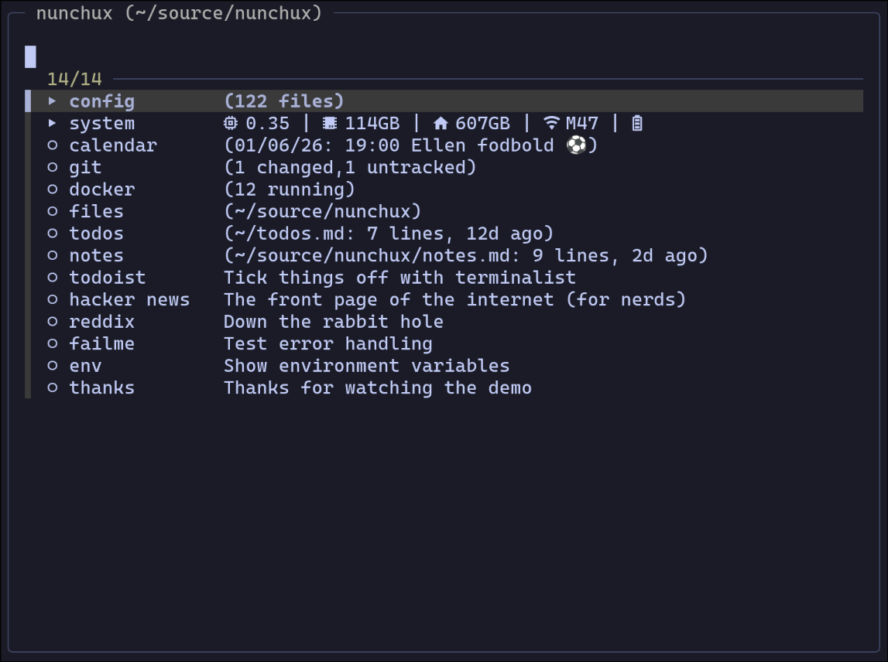

# Nunchux :-)

A tmux launcher for your often used apps, files, and build tasks.

## What it can do

Invoke nunchux with a shortcut (default: `prefix + g`) to get a fuzzy-searchable
list of your configured:

- **apps**: whatever that may mean to you; TUI app, setting an env var, running
  a script.

- **submenues**: groupings of apps, maybe collect system and/or news apps in a
submenu.

- **directory browsers**: quick editing of often used files and directories.
Good for dotfiles.

- **task runner**: quick access to task runner tasks from justfile,
package.json, taskfile.

For each app or submenu it is possible to configure a status message. The
message can be static or dynamic. Are you already now thinking it will be dog
slow? Don't worry, nunchux uses caching to keep things snappy.

## What it looks like

### Screenshot



### Gif

[](https://vhs.charm.sh/vhs-4H4NyQC5bYtYGpNkb6vIaH.gif)

## How to install it

Use [TPM](https://github.com/tmux-plugins/tpm) for a smooth experience. Add
this to your tmux.conf:

```
set -g @plugin 'datamadsen/nunchux'
```

Then hit `prefix + I` and you're good to go.

To update to the latest version, hit `prefix + U` and type `nunchux` (or `all`
to update all plugins).

## How to invoke it

By default the menu is invoked with `prefix + g`, but you can change it:

```
set -g @nunchux-key 'a'
```

If you want to invoke it without the prefix, e.g. with `Ctrl-Space`:

```
set -g @nunchux-key 'C-Space'
```

## How to configure it

Nunchux searches for config in this order:

1. `.nunchuxrc` in current directory or any parent.
2. `NUNCHUX_RC_FILE` environment variable.
3. `~/.config/nunchux/config`

You can also run nunchux without a config and it will offer to create one for
you.

### Also see

- [docs/configuration.md](docs/configuration.md) for the full reference.
- [docs/examples.md](docs/examples.md) for real-world examples.

### Shell Integration

If you use nvm, pyenv, or other tools that modify your shell environment, you'll
want apps launched via nunchux to inherit that environment.

**Why is this needed?**

Tmux popups run in tmux's *server* environment, not your shell's environment.
When you run `nvm use 18` or `export FOO=bar`, those changes only exist in your
shell - tmux doesn't know about them. There's no tmux API to "run a command
inside a pane's shell context", so we work around it with a shell hook that
saves your environment after each command. When nunchux launches an app, it
reads that saved environment.

Add this to your shell rc file:

**Bash** (`~/.bashrc`):

```bash
source ~/.tmux/plugins/nunchux/shell-init.bash
```

**Zsh** (`~/.zshrc`):

```zsh
source ~/.tmux/plugins/nunchux/shell-init.zsh
```

**Fish** (`~/.config/fish/config.fish`):

```fish
source ~/.tmux/plugins/nunchux/shell-init.fish
```

This saves your environment after each command, so apps launched from nunchux
(even from within vim or lazygit) inherit your current PATH, exports, etc.

## Dependencies

- tmux
- fzf v0.66+
- curl (for menu hot-swap)

### Task runner dependencies

| Task Runner | Required |
|-------------|----------|
| just | [just](https://github.com/casey/just) |
| npm | jq |
| task | [task](https://taskfile.dev) or go-task, jq |
